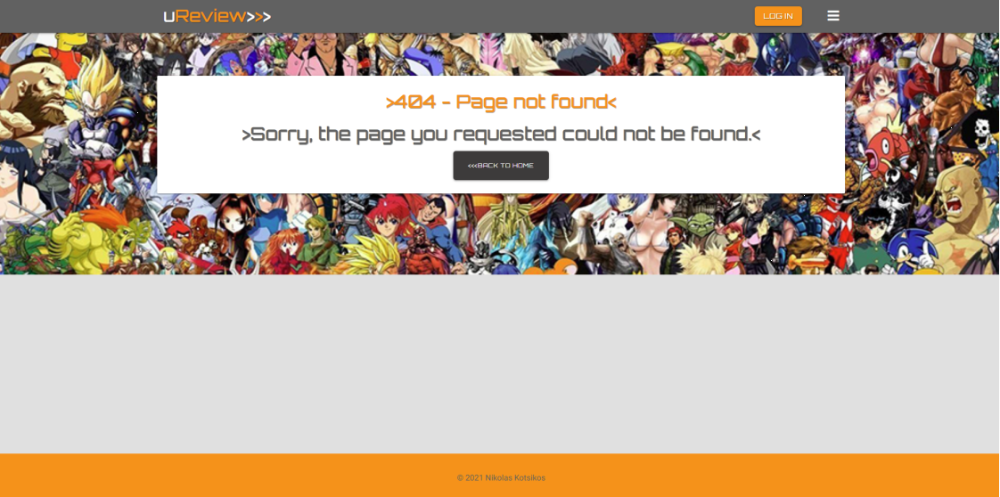
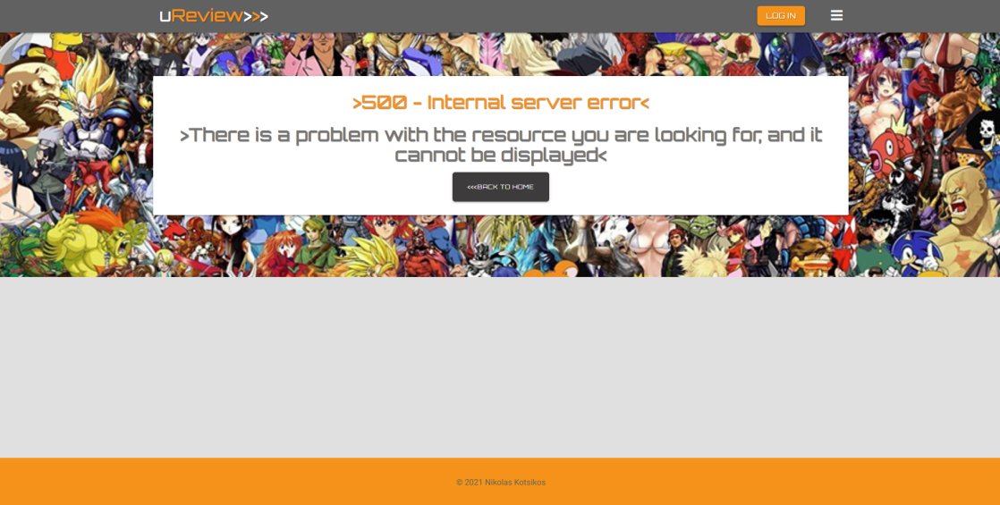
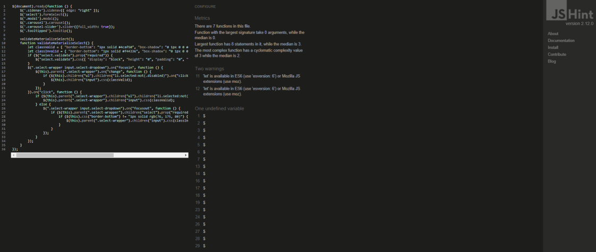
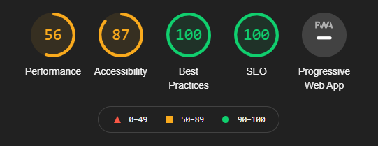

## &rarr; **Testing**

**

 Testing Documentation
**
  - [Admin tools](#admin-tools)
  - [Testing user stories](#testing-user-stories)
  - [Manual function testing](#manual-function-testing)
  - [Validator checks](#validator-checks)
  - [Audits](#audits)
  - [Responsive Design](#responsive-design)
  - [Additional Testing](#additional-testing)
  - [Bugs](#bugs)

---

### Admin tools 

uReview features tools specifically for the site's administrator. In order to access the app as an administrator, use the credentials provided bellow.

**

<u>Assessor only!</u>
**
  > **Note**: Use admin as the username and LidakiPixi3 as the password to access the admin functionality of the app.

 

### Testing user stories

Testing my site visitor's <u>key priorities</u>:

**1. As a visitor I want to easily navigate the site and find reviews from the home page.**
- Site includes a main navbar featuring a side nav, with same and different page navigation. 
- Navigation menu is fixed so is always visible to the user.
- The home page features four distinct ways to find reviews: a call-to-action button on the orange text overlay, a keyword search bar, a by genre selection carousel and a by platform selection carousel.
- Brand logo directs the user back to the homepage from anywhere on the site.
- 404 & 500 Error pages: I decided to create a custom 404.html & 500.html page for my user so if they are directed to a non-existent domain or encounter an internal server error, 
  they are presented with a consistent and appealing page and an easy navigation button back to the homepage.
   
**2. As a visitor I want to be able to sort and search posted reviews based on a categories or keywords.**
- Search bar to allow the user to search for reviews using keywords. The search bar is set up to filter reviews based on genres & platfoms name, review name, developer name or any keyword included in the review text.
- Carousels allow the user to sort reviews from the home screen by genre or by platform. In addition links to all genres and all platforms pages have been provided in the side nav menu.

**3. As a visitor I want to find where I can create an account easily.**
- When the user arrives to the home page the ‘Create Account’ button is visible to the user immediately. The link is also accessible via the nav menu.
- A third link to create account is present within the about card text .

Testing my site registered user's <u>key priorities</u>:

**1. As a registered user I want to easily find how I can log-in in order to post a review.**
- Clear login button visible on the navbar as soon as the user enters the site.
  - Login link included in the nav menu, displays 'log out' and the user's username if they are logged in.
  - As the navbar is repeated on all pages of the site, the user can log in from any page.
  - If a user is logged in, the button will display 'log out' and the user's username.
  - The user is redirected to their profile page that contains a button to post a review. 

- After clicking the log in button, the user is directed to a login page, where there is a link connecting to the create account page in case of a mistake.
  - Validation is included in the input fields to let the user know if their input is valid through colour formatting. 
  - Recognisable info icon with tooltip to let the user know which characters can be used.

- User responses include notifying the user of any errors or success:
  - Success messages are flashed between the navbar and main content on the top of the screen.
  - Errors are flashed between the navbar and main content on the top of the screen.

**2. As a registered user I want to be able to add and read my review easily.**
- When the user is logged in the 'Add a Review' button is visible to the user on the first view of the site. 
- The link is also always accessible via the nav menu for a logged in user.
- On the reviews page when visiting as a registered user the 'Add a Review' button appears right under the search bar on the top of the screen. 
- When the user clicks 'Add a Review' they are taken to the add review page which presents the user with a template of inputs to fill out.
- After posting their review the user is redirected to My Reviews page where they can see their review preview card.
- The review page contains review preview cards displaying review image, review name, genres & platfoms, and who the review was created by.
- The user can click onto a review card to direct them to the read review page which displays the full review text.
- Navigation-link to reviews also included in the dropdown menu.

**3. As a registered user I want to see a collection of my posted reviews in one page.**
- After logging in the user is redirected to the Profile page, where they will find a 'My Reviews' button which takes them to a page showing only their posted reviews with more recent posts sorted first.
- A link to My Reviews is also always accessible via the nav menu for a logged in user.

**4. As a registered user I want to have a profile page that bundles functionality.**
- After logging in the user is redirected to the Profile page, where they will find three buttons: one taking them to the overall reviews page, one taking them to their posted reviews (My Reviews page) and one for adding a new review.

**5.As a registered user I want to be able to edit and delete my reviews.**
- The edit and delete buttons are only available to the user who created the reviews. These are found on the individual preview and review cards and are only visible when the user is logged in.
  - When the user clicks edit they will be directed to the edit page which is the same template as the add review page but input fields are already pre-filled with previous input.

  - When the user selects delete they will be presented with a confirmation modal to confirm their action.

**6. As a registered user I want to see new content first on consequtive site visits.**
- Reviews are sorted by most recent entries in both Reviews and My Reviews page, to keep the website fresh on consequtive visits.

Testing my site administrator's <u>key priorities</u>:

**1. As an administrator I want to easily moderate user posted contents.**

- The site's administrator can delete reviews posted by any user. The relevant buttons appear on all reviews for them.

**2. As an administrator I want to be able to manage genres and platforms by adding new ones or deleting underused ones.**

- The individual pages for genres and platforms feature a button for adding a new genre/platform. 
- The admin user has the option to edit or delete existing genres/platforms from their respective pages.
- The nav menu links for the admin user reflect that by changing to Manage Genres/Platforms respectively.

 

#### Manual function testing

To ensure my site was working correctly I carried out some manual function testing;

**1. Site navigation**

- I checked the site dropdown menu was working correctly by starting on the home-page and navigating around the site from and to every screen the user would be faced with.

- I checked the logo homepage navigation was working by clicking on the brand image from every page.

- 404 Error page was tested by creating a broken link in the URL and making sure it responded with my custom page.
 

- 500 Error page was tested by creating a broken internal link in the URL and making sure it responded with my custom page.

**2. Hover, focus, and active effects**

- I hovered over every button element to ensure the correct brightness effect was in place.

**3. Log in, register, and logout function**

- To check the login functionality was working I first clicked on the 'login' button to ensure the link redirected to the login page, which it did. When presented with the modal I conducted various checks;
  - I filled out the login form with an already registered username and password then clicked 'Login'. I was redirected to the Profile page, the login button changed to log out and I received a message 'admin successfully logged in'.
   - I filled out the login form with a new username and password then clicked 'Login'. The modal stayed open and responded with a red flash message 'Incorrect Username and/or password'.

- To check the Create Account functionality was working I first clicked on the 'login' button to ensure the page was redirected properly, which it did. On it I conducted some checks;
  - I filled out the registration form with a new username and password then clicked 'Register'. I was redirected to my Profile page, the login button changed to log out and I received a message 'Welcome admin'.

   - I filled out the login form with an already registered username and password then clicked 'Register'. The modal stayed open and responded with a red flash message 'Username already exists, please log in'.
  
- I could also see that after logging in and registering successfully I had additional buttons displayed to me so I knew it was working. The log in functionality was tested throughout all pages of the site.

- Once I was logged in and the 'log out admin' button was available I clicked this to check that it logged me out correctly. The log out button changed to log in, I received a message 'You have been logged out'. In the nav menu and home page the additional buttons were no longer visible to me so I knew it was working. This was tested throughout all pages of the site.

**4. Form validation checks**

- Login/Register form validation errors;
  - I entered an invalid username into the username field and was displayed with 'Please match the format requested'.
  - I entered an invalid password into the password field and was displayed with 'Please match the format requested'.

- I checked the information tooltips were working by hovering over the information icon.

- I tested the add/edit review and genres & platfoms templates by inputting valid and invalid data and checking that I received the correct responses.

**5. Reviews and keyword search bar**
- I clicked on the 'Reviews' button on the homepage callout section and the link within the dropdown menu, and both correctly navigated to the reviews page. This was checked from all pages of the site.

- After adding my search indexes via the python interpreter I entered 'mongo.db.reviews.index_information()' to check that the correct details had been added. I also checked this by clicking on the 'indexes' section on MongoDB.

- I submitted a selection of words into the review search bar to ensure the query function was filtering the reviews correctly, and all worked correctly.

**6. Reading reviews**
- I clicked on each review card to make sure it displayed the correct information to me when navigated to the view reviews HTML template, and it did.

**7. Adding review**
- I logged in as a variety of different users to check that the add review button was only visible on the homepage and reviews page if a user was logged in.

- I clicked on the 'Add a Review' button on the homepage callout section and the link within the dropdown menu, and both correctly navigated to the add review page. This was checked from all pages of the site.

**8. Editing review**
- I logged in as a variety of different users to check that the edit button was only visible on the reviews the specific user had added.

- I clicked on the 'Edit' button on the review cards to test that I was correctly navigated to the edit review page and that the fields were already prefilled with the previous data inputted.

**9. Deleting review**
- I logged in as a variety of different users to check that the delete button was only visible on the reviews the specific user had added.

- I clicked on the 'Delete' button on the review cards to test that I was correctly presented with a modal for delete confirmation. I then clicked the 'delete' button on the modal and checked if the review card had been removed.

**10. Link to genres & platfoms page**
- I clicked on the 'genres & platfoms' link within the dropdown menu to check that I was correctly navigated to the genres & platfoms page. This was checked from all pages of the site.
  - Once on the genres & platfoms page I clicked on each genre/platfom card to ensure I was correctly navigated to the reviews page, filtered by the correct genre/platfom type.

- On the homepage, I clicked on every carousel item to ensure I was directed to the reviews by genre/platform page, filtered by the correct genre/platfom type.

**11. Adding genres & platfoms**
- I logged in as different users to check that the 'add genres & platfoms' option in the dropdown menu and the 'add genres & platfoms' button on the genres & platfoms page was only visible when the specified admin user was logged in.

- I clicked on 'add genres & platfoms' to ensure that I was directed to the add genres & platfoms page. I then entered the genres & platfoms name and image URL into the form and clicked the submit 'add' icon to check if the new genres & platfoms was added, and it was.

**12. Editing genres & platfoms**

- I logged in as different users to check that the 'edit' button was only visible on the genres & platfoms cards if I was logged in as the specified admin user.

- I clicked on the 'edit' button on various genres & platfoms cards to ensure that I was directed to the edit genres & platfoms page. I then updated the genres & platfoms name and image URL and clicked the submit 'edit' icon to check if the genres & platfoms had been updated, and it was.

**13. Deleting genres & platfoms**
- I logged in as different users to check that the 'Delete' button was only visible on the genres & platfoms cards if I was logged in as the specified admin user.

- I clicked on the 'Delete' button on all the review cards to test that I was correctly presented with a modal for delete confirmation. I then clicked the 'Delete' button on the modal and checked if the genres & platfoms card had been removed, it had.

#### Validator checks

The W3C Markup Validator and W3C CSS Validator Services were used to validate every page of the project to ensure there were no syntax errors in the project. The code was entered through direct input. JS hint was used to check for any errors with my Javascript files. 
JS was also tested by opening the developer console window on Chrome and checking for any errors as I clicked through the site.
I used the PEP8 online checking tool to inspect my Python code against the style conventions in PEP 8.

- [**HTML Validator**](https://validator.w3.org/)

   <u>Warnings received;</u>     
  Received 2 warnings about the flashed messages section not containing any h2-h6 elements, which is due to no flashed messages being displayed when source code was captured, and for the type attribute being unnecessary for JavaScript resources.
  - To get the most accurate read of my HTML for validation, I ran my app and extracted my code from the 'View page source'.
  - Due to the high number of html pages no screen captures were included to make this file more readable. 

- [**CSS Validator**](https://jigsaw.w3.org/css-validator/)
    
    <u>Errors received;</u>

   > Received 16 Value Error : font-size Parse Error (1600 - 300))) messages, that pertain to the calc code used to make the fonts responsive. After consultation with tutors they were considered safe to ignore. 
   > Received 2 parse errors in line 364 and 369 regarding a :not() selector being applied.
   After consultation with tutors they were all considered safe to ignore. 

- [**JS hint**](https://jshint.com/)

  

  <u>**script.js**</u>

  <u>Warnings received;</u>

  > 'let' is available in ES6 (use 'esversion: 6') or Mozilla JS extensions (use moz).

  Warnings occurred as JShint is using ECMAScript 5.1 specification and my code uses ECMAScript 6 specific syntax. However, all code is valid.

  <u>Undefined variables;</u>

  > $

  $ (Jquery) defined in base.html.

    These variables are all from Materialize's JS so I decided to ignore them.

- **Developer tools**

  No error message present in the console.

- [**PEP8 online check**](http://pep8online.com/)
  
  app.py:

  'All right'

#### Audits

[Lighthouse](https://developers.google.com/web/tools/lighthouse) was used to run a series of audits to improve the quality of web pages. Overall performance and errors are highlighted below.

- To improve performance I added [lazy loading](https://web.dev/browser-level-image-lazy-loading/) to all my images to reduce page weight, allowing for a quicker page load time.

<u>Performance</u>

The low-performance review was mainly driven by the following metrics:

- Properly size images;

  As images are uploaded through the image URL form input I am not able to take any action on adjusting image sizes.

- Serve images in next-gen formats;

  I tried converting my images to JPEG 2000 as suggested, however, the images were not loading due to their limitations of only working on certain browsers. Therefore I have kept my image in a PNG and JPG format.

#### Responsive Design

- Site created as a mobile-first design.

- Viewport tag included in the head of HTML files to tell the browser how to respond to different resolutions, particularly mobile ones.

- Media queries used in the CSS file to target larger devices.

#### Additional Testing

- The Website was tested on  the latest versions of Google Chrome, Safari, Mozilla Firefox, Microsoft Edge and Opera web browsers.

- The website was viewed on a variety of devices including Dell Laptop, desktop PC (1440p and 1080p screens), Ipad Air and IPhones (Version 5,6 and XR)

- Friends and family members were asked to review the site to point out any bugs, user experience issues, and/or suggestions. 
   
- For the same purpose the site was submitted for peer review on the [Code Institute](https://codeinstitute.net/) Slack Community and on [Career Karma](https://careerkarma.com/).

- Feedback action:
    - Would like reviews to display with newer additions showing first. **Implemented**
    - Would like to have the option to go easily go back to the reviews page from My Reviews.**Implemented**

#### Bugs

|     | Bug                                                                           | Action                                                            |
|-----|-------------------------------------------------------------------------------|-------------------------------------------------------------------|
| [X] | User could create duplicate accounts                                          | The bug was fixed by correcting a syntax error in the create_account app route in app.py |
| [X] | Review test would not retain user's paragraphing                              | The issue was fixed by wrapping the p element in a pre element and adding the line white-space: pre-wrap in my css file  |
| [X] | Modals wouldn't work on genres and platforms page for editing or deleting     | This bug was fixed by adding edit(loop.index) and delete(loop.index) as the id and data-targets for the modals|
